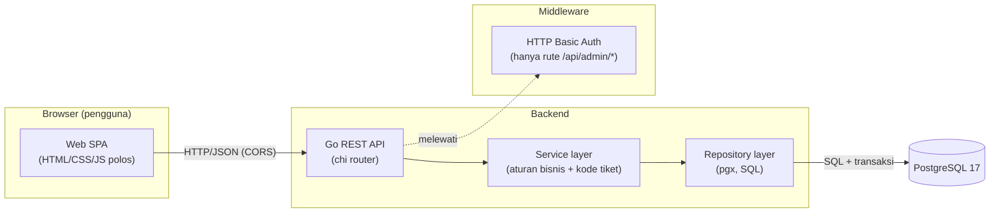
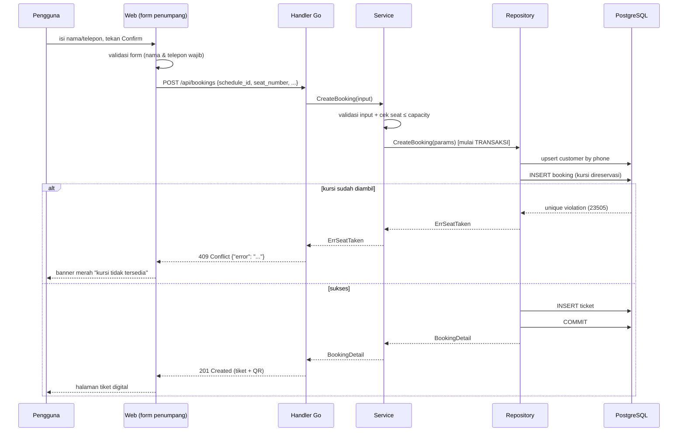

# Dokumen Arsitektur — Travel CRM

Dokumen ini menjelaskan bagaimana sistem tersusun: komponen dan hubungannya,
skema data beserta alasan keputusan yang tidak biasa, penelusuran satu
permintaan nyata dari klik sampai data tersimpan, dan keputusan teknis yang
sempat diragukan beserta alasannya.

> Ruang lingkup produk (untuk siapa, fitur apa yang masuk/dibuang) ada di
> [README.md](../README.md) dan [`TRAVEL_CRM_CODING_PROMPT.md`](../TRAVEL_CRM_CODING_PROMPT.md).
> Singkatnya: CRM untuk **operator travel** dan **penumpangnya**, memecahkan
> masalah "penumpang harus menghubungi admin manual untuk reschedule" dengan
> memberi penumpang kemampuan reschedule mandiri berbekal kode tiket.

---

## 1. Diagram komponen



**Bagian dan tanggung jawabnya:**

| Komponen | Tanggung jawab |
|----------|----------------|
| **Web SPA (vanilla JS)** | UI penumpang & admin, HTML/CSS/JS tanpa framework. `js/api.js` jadi satu-satunya titik keluar HTTP; navigasi memakai screen-stack sederhana. Tidak menyimpan aturan bisnis. QR tiket cukup `` ke endpoint backend. |
| **Handler (Go)** | Terjemahan HTTP ↔ domain: baca query/body, panggil service, petakan error domain ke kode HTTP (400/404/409). |
| **Service (Go)** | Aturan bisnis: validasi, generate kode booking/tiket, cek kapasitas kursi, orkestrasi. Tidak tahu soal HTTP maupun SQL. |
| **Repository (Go)** | Akses data: query SQL, transaksi. Satu-satunya lapisan yang menyentuh database. |
| **PostgreSQL** | Sumber kebenaran. Menegakkan keunikan kursi lewat constraint, bukan lewat cek di aplikasi. |

Pemisahan handler → service → repository dipilih supaya setiap lapisan bisa
dijelaskan dan diuji sendiri, dan supaya "di mana validasi terjadi" punya jawaban
tunggal (service), "di mana keunikan kursi dijaga" punya jawaban tunggal (DB).

---

## 2. Skema data

```mermaid
erDiagram
    customers ||--o{ bookings : "punya"
    routes ||--o{ schedules : "punya"
    schedules ||--o{ bookings : "diisi"
    bookings ||--|| tickets : "menerbitkan"
    bookings ||--o{ reschedule_history : "mencatat"

    customers {
        bigserial id PK
        text name
        text phone UK "unik: find-or-create"
        text email "opsional"
    }
    routes {
        bigserial id PK
        text origin
        text destination
        UK origin_destination
    }
    schedules {
        bigserial id PK
        bigint route_id FK
        timestamptz departure_at
        int capacity
    }
    bookings {
        bigserial id PK
        bigint customer_id FK
        bigint schedule_id FK
        text booking_code UK
        int seat_number
        text status "CONFIRMED"
    }
    tickets {
        bigserial id PK
        bigint booking_id FK "unik 1:1"
        text ticket_code UK
        text status "VALID"
    }
    reschedule_history {
        bigserial id PK
        bigint booking_id FK
        bigint old_schedule_id FK
        int old_seat_number
        bigint new_schedule_id FK
        int new_seat_number
    }
```

Definisi lengkap: [`backend/migrations/001_init.sql`](../backend/migrations/001_init.sql).

### Keputusan skema yang tidak biasa (beserta alasannya)

1. **Partial unique index untuk kursi**
   ```sql
   CREATE UNIQUE INDEX bookings_seat_unique
       ON bookings (schedule_id, seat_number)
       WHERE status = 'CONFIRMED';
   ```
   Keunikan kursi dijaga **di database**, bukan dengan "SELECT lalu INSERT" di
   aplikasi. Kenapa: cek di aplikasi punya celah balapan (race) — dua permintaan
   bisa lolos cek yang sama sebelum salah satunya menyimpan. Index ini membuat
   kursi ganda **mustahil** bahkan saat permintaan bersamaan; database menolak
   yang kedua dan aplikasi menerjemahkannya jadi `409 Conflict`. Klausa
   `WHERE status='CONFIRMED'` membuat kursi yang dilepas bisa dipakai lagi.

2. **`phone` unik + pola find-or-create pada customer**
   Penumpang tak punya akun (keputusan produk). Nomor telepon jadi identitas
   alami: saat booking, customer di-*upsert* berdasarkan telepon
   (`ON CONFLICT (phone) DO UPDATE`). Konsekuensi yang disadari: dua orang tak
   bisa berbagi satu nomor. Untuk MVP ini dapat diterima; batasan ini dicatat.

3. **Tiket 1:1 dengan booking (`booking_id` UNIQUE)**
   Setiap booking menerbitkan tepat satu tiket. Reschedule **tidak** membuat
   tiket baru — ia memperbarui booking dan me-*refresh* tiket yang sama —
   sehingga kode tiket yang dipegang penumpang tetap berlaku setelah reschedule.

4. **`reschedule_history` sebagai tabel audit sederhana**
   Menyimpan kursi & jadwal lama vs baru. Sengaja tidak memakai event-sourcing;
   satu baris per reschedule cukup untuk menjawab "riwayat perubahan booking ini".

5. **`capacity` sebagai integer, kursi diberi nomor 1..N**
   Tidak ada tabel `seats` tersendiri. Peta kursi dihitung saat diminta:
   kursi tersedia = `{1..capacity}` dikurangi kursi yang sudah CONFIRMED. Ini
   menghindari tabel kursi yang harus disinkronkan; harganya, tak ada atribut
   per-kursi (kelas, harga). Untuk MVP tak diperlukan.

---

## 3. Alur satu permintaan: membuat booking

Aksi nyata: penumpang menekan **Confirm booking**.



**Di mana validasi terjadi (berlapis, sengaja):**

| Lapisan | Yang diperiksa | Kalau gagal |
|---------|----------------|-------------|
| Form (JS) | nama & telepon terisi | validasi klien menahan submit |
| Service | input tidak kosong, `seat ≤ capacity`, jadwal ada | `400 Bad Request` |
| Database | kursi belum dipakai (partial unique index) | `409 Conflict` |

**Kalau gagal di tengah jalan:** seluruh langkah repository berjalan dalam satu
transaksi pgx dengan `defer tx.Rollback()`. Jika INSERT tiket gagal setelah
INSERT booking, transaksi di-*rollback* — tak ada booking yatim tanpa tiket, dan
kursi tidak "tersangkut" terpakai. Database kembali ke keadaan sebelum permintaan.

Alur **reschedule** mengikuti pola yang sama
([`repository/bookings.go`](../backend/internal/repository/bookings.go)):
`SELECT ... FOR UPDATE` mengunci booking, `UPDATE` memindahkannya ke jadwal/kursi
baru (kursi lama otomatis bebas karena baris yang sama berpindah), lalu mencatat
history — semuanya dalam satu transaksi.

---

## 4. Keputusan teknis (apa diputuskan · alternatif · kenapa · yang dikorbankan)

| Keputusan | Alternatif | Kenapa yang ini | Yang dikorbankan |
|-----------|-----------|-----------------|------------------|
| **Go untuk backend** | Node/Express, Python/FastAPI | Tipe statis, binari tunggal tanpa runtime, konkurensi & pool DB matang, mudah dijelaskan baris per baris | Ekosistem lib lebih kecil; lebih banyak kode "manual" (mis. scan baris) dibanding ORM |
| **Vanilla HTML/CSS/JS untuk frontend** | React/Next.js, Flutter Web | App kecil (~8 layar) tak butuh framework; tanpa build step; setiap baris bisa dijelaskan saat wawancara; deploy = file statis | State & DOM diurus manual (tak ada reaktivitas otomatis); lebih banyak kode boilerplate untuk hal yang framework beri gratis |
| **QR digenerate di backend Go** | Library QR di sisi klien | Frontend tetap murni (`` saja); QR hanya berisi kode = pointer ke DB, tak bisa dipalsukan klien | Tambah 1 dependensi Go + 1 request per QR |
| **PostgreSQL** | MySQL, SQLite | Butuh partial unique index & transaksi kuat untuk keunikan kursi; relasional pas dengan model | Operasional lebih berat dari SQLite (perlu server) |
| **pgx tanpa ORM** | GORM, sqlc | SQL eksplisit yang bisa dijelaskan; kontrol penuh atas transaksi & constraint | Boilerplate scan manual; tak ada migrasi otomatis dari model |
| **Keunikan kursi lewat DB constraint** | Cek di aplikasi (SELECT lalu INSERT) | Anti-balapan, benar bahkan saat konkuren; DB jadi sumber kebenaran | Error datang sebagai pelanggaran constraint yang harus diterjemahkan (23505 → 409) |
| **Reschedule = pindahkan baris booking** | Batalkan booking lama + buat baru | Kursi lama bebas otomatis; kode tiket penumpang tetap sama | Tak ada "booking lama" terpisah untuk dilihat; history disimpan di tabel audit |
| **Akses via kode booking/tiket (tanpa login penumpang)** | Registrasi akun + OTP | Sesuai keputusan produk: friksi rendah untuk use-case jarang | Siapa pun yang tahu kode bisa melihat/reschedule; dapat diterima untuk MVP prototipe |
| **Admin HTTP Basic Auth** | Sesi + JWT, OAuth/SSO | Mekanisme paling sederhana yang memenuhi kebutuhan; `crypto/subtle` untuk banding anti-timing | Tanpa manajemen user/peran; satu kredensial bersama |
| **Migrasi = file SQL idempoten + runner mungil** | golang-migrate, Atlas | Tanpa CLI eksternal untuk dipasang; `CREATE TABLE IF NOT EXISTS` aman diulang | Tanpa migrasi turun/versi; cukup untuk MVP |
| **Nomor kursi dihitung, tanpa tabel `seats`** | Tabel kursi eksplisit | Tak ada state kursi yang harus disinkronkan | Tak bisa memberi atribut per-kursi (kelas/harga) |
| **Navigasi screen-stack sederhana (push/pop)** | Framework router / hash routing | 8 layar, alur linear; ~30 baris, mudah dijelaskan | Tak ada deep-link/refresh-persist (sama seperti app aslinya); state antar layar lewat argumen fungsi |
| **Backend opsional menyajikan file statis (`STATIC_DIR`)** | Selalu dua server terpisah | Satu origin, satu proses untuk deploy; tak wajib | Menggabung tanggung jawab API + file server dalam satu biner |

---

## 5. Ringkas untuk pembaca yang terburu-buru

- Tiga lapis backend (handler/service/repository) + PostgreSQL sebagai sumber kebenaran.
- Aturan yang paling penting — **satu kursi tak bisa dipesan dua kali** — dijaga
  oleh database, bukan aplikasi, sehingga benar bahkan di bawah konkurensi.
- Booking & reschedule bersifat transaksional; gagal di tengah = rollback bersih.
- Autentikasi penumpang sengaja tak ada; admin memakai Basic Auth paling sederhana.
- Setiap keputusan di atas punya alternatif yang dipertimbangkan dan harga yang disadari.
